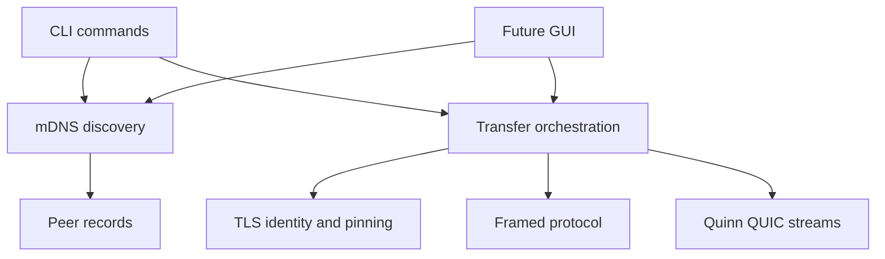
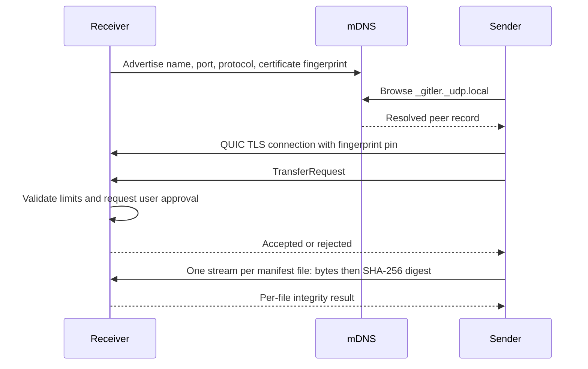

# Architecture

## Recommendation

Ship CLI first. Stabilize wire protocol, discovery behavior, identity model, and cross-platform networking before adding GUI. Later GUI should call library-facing application services rather than own sockets.

## Module boundaries

- `cli`: argument model only.
- `discovery`: DNS-SD advertisement, peer parsing, and scan lifecycle.
- `security`: ephemeral certificate creation and exact fingerprint verifier.
- `protocol`: versioned, length-prefixed control messages.
- `transfer`: file I/O, QUIC connections, integrity checks, destination policy, and progress.

## Wire flow

Control messages use big-endian `u32` length followed by JSON, capped at 16 KiB. `TransferRequest` carries a file manifest; each file uses a separate bidirectional QUIC stream identified by its manifest index. File bodies stream directly and are bounded by declared `u64` size. Digest trailers are 32 raw bytes.

## Security decisions

Current identity is ephemeral per receiver process. Fingerprint travels in mDNS TXT data and is pinned during TLS handshake. This detects mismatch between advertisement and endpoint but does not authenticate mDNS. Active first-contact spoofing remains possible. Interactive approval is default; `--accept-all` is intended only for trusted LANs.

Recommended next security milestone:

1. Persist Ed25519 device identity in OS config directory with owner-only permissions.
2. Derive TLS identity binding from persistent key.
3. Store known peer fingerprints using trust-on-first-use.
4. Show short authentication string for first transfer when sensitive mode is enabled.
5. Bind approval decisions to persistent peer identities.

## Planned evolution

1. IPv6 scoped-address support.
2. Resumable chunks with content-addressed verification.
3. Persistent trusted peers and configurable approval policy.
4. Core API extracted behind event channels for `egui` or Tauri.
5. Benchmarks for chunk size, stream parallelism, and UDP buffer tuning.

Avoid transport trait abstraction until second transport exists. Quinn stays concrete now; protocol and discovery boundaries already isolate likely change points without premature dynamic dispatch.
